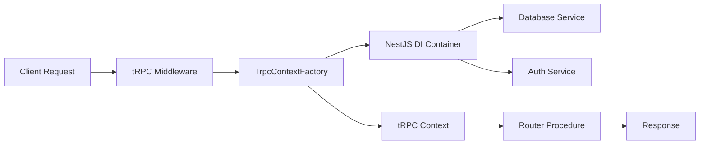

## Overview

Sunny Stack uniquely combines **NestJS's dependency injection** with **tRPC's type safety**. NestJS services are injected into tRPC context, giving you the best of both worlds.

## Architecture



## tRPC Setup

The core tRPC instance is configured in `trpc/trpc.ts`:

```ts trpc/trpc.ts
import { initTRPC, TRPCError } from '@trpc/server';
import superjson from 'superjson';
import { z, ZodError } from 'zod';
import type { TrpcContext } from './context.factory';
import { AppError } from './error';

export const t = initTRPC.context<TrpcContext>().create({
  transformer: superjson,
  errorFormatter({ shape, error }) {
    const cause = error.cause;

    return {
      ...shape,
      data: {
        ...shape.data,

        // Zod validation errors, inferred to client
        zodError:
          error.code === 'BAD_REQUEST' && cause instanceof ZodError
            ? z.flattenError(cause)
            : null,

        // Your app semantic errors, inferred to client
        appCode: cause instanceof AppError ? cause.appCode : null,
        field: cause instanceof AppError ? cause.field : null,
      },
    };
  },
});

export const router = t.router;

// Auth middleware
const requireUser = t.middleware(({ ctx, next }) => {
  if (!ctx.user || !ctx.session) {
    throw new TRPCError({ code: 'UNAUTHORIZED', message: 'Login required' });
  }
  return next({
    ctx: {
      ...ctx,
      user: ctx.user,
      session: ctx.session,
    },
  });
});

// Procedures
export const publicProcedure = t.procedure;
export const protectedProcedure = t.procedure.use(requireUser);
```

### Key Features

<AccordionGroup>
  <Accordion title="SuperJSON Transformer">
    Automatically serializes/deserializes Dates, Maps, Sets, and other complex types. No manual conversion needed.
  </Accordion>
  <Accordion title="Custom Error Formatter">
    Extracts Zod validation errors and custom app errors for type-safe error handling on the client.
  </Accordion>
  <Accordion title="Auth Middleware">
    `requireUser` middleware enforces authentication and narrows context types.
  </Accordion>
  <Accordion title="Public & Protected Procedures">
    Base procedures for building endpoints with or without authentication.
  </Accordion>
</AccordionGroup>

## Context Factory

The `TrpcContextFactory` bridges NestJS and tRPC:

```ts trpc/context.factory.ts
import { Inject, Injectable } from '@nestjs/common';
import type { Session, User } from 'better-auth';
import type { Request } from 'express';
import { AuthSessionService } from '@/core/auth/auth-session.service';
import type { Database } from '@/core/database';
import { DB_CONNECTION } from '@/core/database/database.constants';

export type TrpcContext = {
  db: Database;
  session: Session | null;
  user: User | null;
};

@Injectable()
export class TrpcContextFactory {
  constructor(
    @Inject(DB_CONNECTION) private readonly db: Database,
    private readonly authSessions: AuthSessionService,
  ) {}

  async create(req: Request): Promise<TrpcContext> {
    const sessionResult = await this.authSessions.getSession(req);

    return {
      db: this.db,
      session: sessionResult?.session ?? null,
      user: sessionResult?.user ?? null,
    };
  }
}
```

### How It Works

<Steps>
  <Step title="NestJS creates TrpcContextFactory">
    The factory is instantiated by NestJS with database and auth services injected
  </Step>
  <Step title="tRPC calls create() per request">
    Every tRPC request calls `ctxFactory.create(req)` from `main.ts`
  </Step>
  <Step title="Session is fetched">
    `AuthSessionService` validates the session from request cookies/headers
  </Step>
  <Step title="Context is returned">
    The context object contains `db`, `session`, and `user` for all procedures
  </Step>
</Steps>

## TrpcModule

The module exports the context factory:

```ts trpc/trpc.module.ts
import { Module } from '@nestjs/common';
import { AuthModule } from '@/core/auth/auth.module';
import { TrpcContextFactory } from './context.factory';

@Module({
  imports: [AuthModule],
  providers: [TrpcContextFactory],
  exports: [TrpcContextFactory],
})
export class TrpcModule {}
```

## App Router

The root router combines all feature routers:

```ts trpc/app.router.ts
import { booksRouter } from '@/modules/books/trpc/books.router';
import { router } from './trpc';

export const appRouter = router({
  books: booksRouter,
  // users: usersRouter,
});

export type AppRouter = typeof appRouter;
```

<Note>
  The `AppRouter` type is exported and used by the frontend for type-safe client creation.
</Note>

## Creating Routers

Example from the Books module:

```ts modules/books/trpc/books.router.ts
import { z } from 'zod';
import { bookTable, isDbError } from '@/core/database';
import { throwAppError } from '@/trpc/error';
import { protectedProcedure, publicProcedure, router } from '@/trpc/trpc';

export const booksRouter = router({
  // anyone can call this
  listPublic: publicProcedure.query(async ({ ctx }) => {
    return ctx.db.select().from(bookTable);
  }),

  // only logged-in users can call this
  listProtected: protectedProcedure.query(async ({ ctx }) => {
    return ctx.db.select().from(bookTable);
  }),

  create: protectedProcedure
    .input(z.object({ title: z.string().min(1), publishedAt: z.coerce.date() }))
    .mutation(async ({ ctx, input }) => {
      try {
        const [newBook] = await ctx.db
          .insert(bookTable)
          .values({ title: input.title, publishedAt: input.publishedAt })
          .returning();

        return newBook;
      } catch (error) {
        if (isDbError(error, 'UNIQUE_CONSTRAINT')) {
          throwAppError({
            trpcCode: 'BAD_REQUEST',
            appCode: 'BOOK_TITLE_TAKEN',
            message: 'Book title already taken',
            field: 'title',
          });
        }
        throw error;
      }
    }),
});
```

## Procedure Types

### Public Procedure

```ts
publicProcedure.query(async ({ ctx }) => {
  // ctx.user is User | null
  // ctx.session is Session | null
  return ctx.db.select().from(bookTable);
});
```

### Protected Procedure

```ts
protectedProcedure.query(async ({ ctx }) => {
  // ctx.user is User (guaranteed non-null)
  // ctx.session is Session (guaranteed non-null)
  return ctx.db.select().from(bookTable).where(eq(bookTable.userId, ctx.user.id));
});
```

<Note>
  TypeScript automatically narrows `ctx.user` and `ctx.session` to non-null in `protectedProcedure`!
</Note>

## Input Validation

Use Zod schemas for input validation:

```ts
const createBookInput = z.object({
  title: z.string().min(1).max(200),
  publishedAt: z.coerce.date(),
  isbn: z.string().regex(/^\d{13}$/),
});

export const booksRouter = router({
  create: protectedProcedure
    .input(createBookInput)
    .mutation(async ({ ctx, input }) => {
      // input is fully typed and validated
      const [book] = await ctx.db.insert(bookTable).values(input).returning();
      return book;
    }),
});
```

### Validation Errors

Zod validation errors are automatically formatted and sent to the client:

```ts
// Server
.input(z.object({ email: z.string().email() }))

// Client receives
{
  code: 'BAD_REQUEST',
  message: 'Validation error',
  data: {
    zodError: {
      fieldErrors: { email: ['Invalid email'] },
      formErrors: []
    }
  }
}
```

## Custom Error Handling

Sunny Stack includes a custom `AppError` class for semantic errors:

```ts trpc/error.ts
import { TRPCError } from '@trpc/server';

export type AppErrorCode = 'BOOK_TITLE_TAKEN' | 'ORG_REQUIRED' | 'PAYWALLED' | 'RATE_LIMITED';

export class AppError extends Error {
  constructor(
    public readonly appCode: AppErrorCode,
    message?: string,
    public readonly field?: string,
  ) {
    super(message ?? appCode);
    this.name = 'AppError';
  }
}

// Helper to reduce boilerplate at call sites
export function throwAppError(opts: {
  trpcCode: TRPCError['code'];
  appCode: AppErrorCode;
  message: string;
  field?: string;
}): never {
  throw new TRPCError({
    code: opts.trpcCode,
    message: opts.message,
    cause: new AppError(opts.appCode, opts.message, opts.field),
  });
}
```

### Usage

```ts
import { throwAppError } from '@/trpc/error';

// In your procedure
try {
  await ctx.db.insert(bookTable).values({ title: input.title });
} catch (error) {
  if (isDbError(error, 'UNIQUE_CONSTRAINT')) {
    throwAppError({
      trpcCode: 'BAD_REQUEST',
      appCode: 'BOOK_TITLE_TAKEN',
      message: 'Book title already taken',
      field: 'title',
    });
  }
  throw error;
}
```

### Client-Side Error Handling

The client receives typed errors:

```ts
try {
  await trpc.books.create.mutate({ title: 'Duplicate' });
} catch (error) {
  if (error.data?.appCode === 'BOOK_TITLE_TAKEN') {
    // Show field-specific error
    console.log(`Field: ${error.data.field}`);
  }
}
```

## Queries vs Mutations

<Tabs>
  <Tab title="Query">
    Used for data fetching (GET requests). Results are cached by default.

    ```ts
    listBooks: publicProcedure.query(async ({ ctx }) => {
      return ctx.db.select().from(bookTable);
    });
    ```
  </Tab>
  <Tab title="Mutation">
    Used for data modification (POST requests). Not cached.

    ```ts
    createBook: protectedProcedure
      .input(z.object({ title: z.string() }))
      .mutation(async ({ ctx, input }) => {
        const [book] = await ctx.db.insert(bookTable).values(input).returning();
        return book;
      });
    ```
  </Tab>
</Tabs>

## Middleware

Create custom middleware for cross-cutting concerns:

```ts
// Example: Logging middleware
const loggerMiddleware = t.middleware(async ({ path, type, next }) => {
  const start = Date.now();
  const result = await next();
  const duration = Date.now() - start;
  console.log(`${type} ${path} - ${duration}ms`);
  return result;
});

// Use it
export const loggedProcedure = t.procedure.use(loggerMiddleware);
```

## Mounting in main.ts

The tRPC router is mounted as Express middleware:

```ts main.ts
import * as trpcExpress from '@trpc/server/adapters/express';
import { appRouter } from './trpc/app.router';
import { TrpcContextFactory } from './trpc/context.factory';

const app = await NestFactory.create(AppModule);
const ctxFactory = app.get(TrpcContextFactory);

app.use(
  '/trpc',
  trpcExpress.createExpressMiddleware({
    router: appRouter,
    createContext: ({ req }) => ctxFactory.create(req),
    onError: ({ error }) => {
      console.error('TRPC error:', error);
    },
  }),
);
```

### Key Points

- All tRPC endpoints are under `/trpc/*`
- `createContext` calls the NestJS factory for each request
- `onError` allows global error logging (great for Sentry integration)

## Type Export for Frontend

Export the router type for the frontend:

```ts trpc/public.ts
// The file imported by the public client (e.g. vite dashboard)
export type { AppRouter } from './app.router';
```

The frontend imports this type:

```ts
import type { AppRouter } from '@repo/api/trpc/public';
import { createTRPCClient } from '@trpc/client';

const trpc = createTRPCClient<AppRouter>({
  url: 'http://localhost:8000/trpc',
});

// Fully typed!
const books = await trpc.books.listPublic.query();
```

## Best Practices

<CardGroup cols={2}>
  <Card title="Use Zod for validation" icon="shield-check">
    Always validate input with Zod schemas for runtime safety
  </Card>
  <Card title="Separate routers by feature" icon="folder-tree">
    Keep routers in their respective module folders
  </Card>
  <Card title="Use protectedProcedure wisely" icon="lock">
    Start with protected by default, only use public when needed
  </Card>
  <Card title="Handle errors gracefully" icon="triangle-exclamation">
    Use `throwAppError` for semantic errors with field references
  </Card>
</CardGroup>

## Next Steps

<CardGroup cols={2}>
  <Card title="Database" icon="database" href="/backend/database">
    Learn how to use Drizzle ORM in procedures
  </Card>
  <Card title="Authentication" icon="shield" href="/backend/authentication">
    Understand Better Auth integration
  </Card>
  <Card title="Creating Modules" icon="cube" href="/backend/modules">
    Build feature modules with tRPC routers
  </Card>
  <Card title="Overview" icon="book" href="/backend/overview">
    Back to architecture overview
  </Card>
</CardGroup>